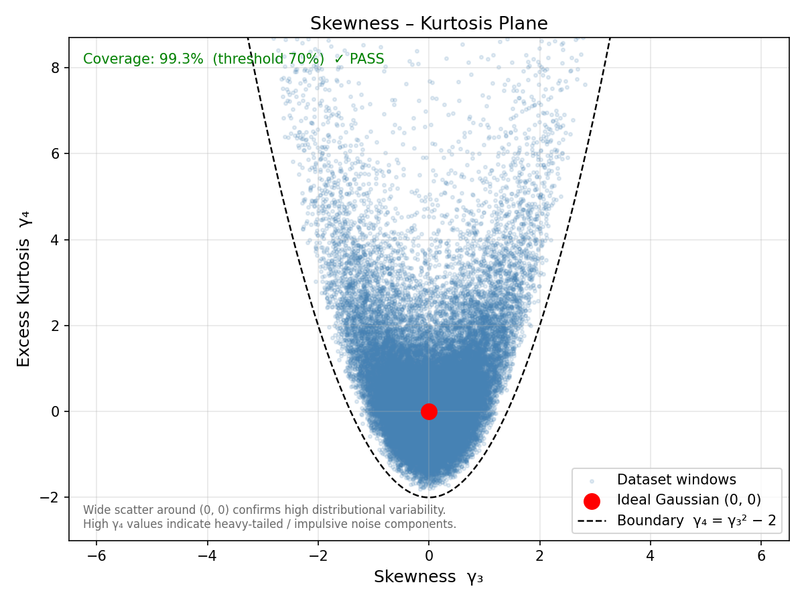
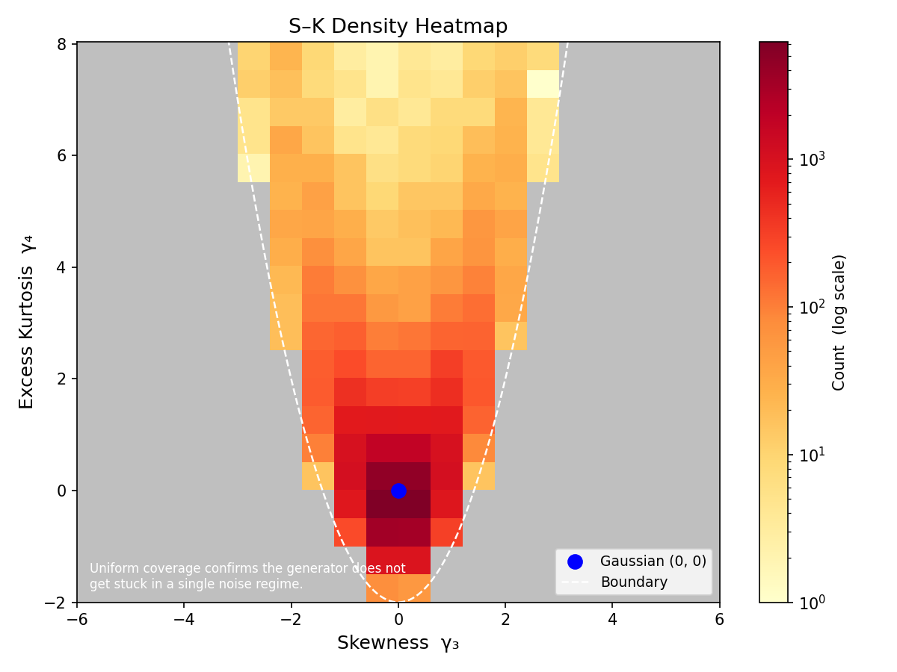
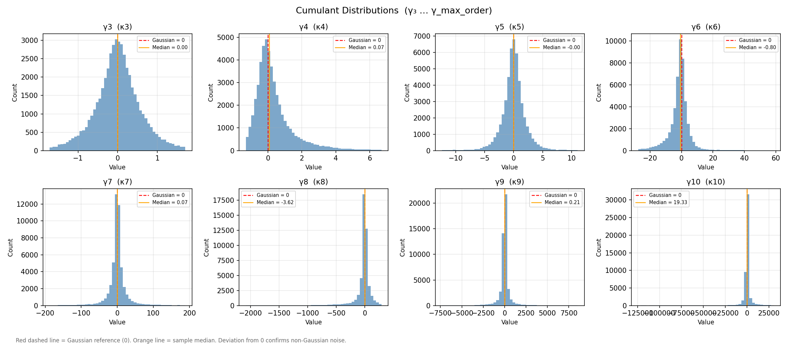
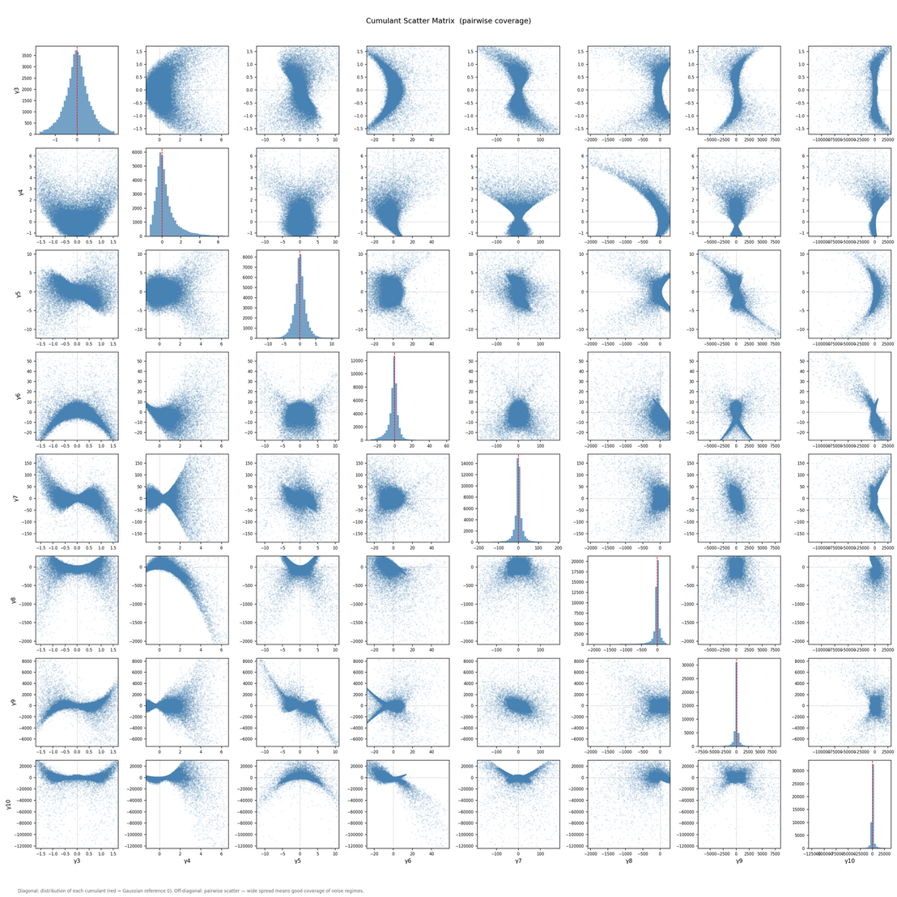
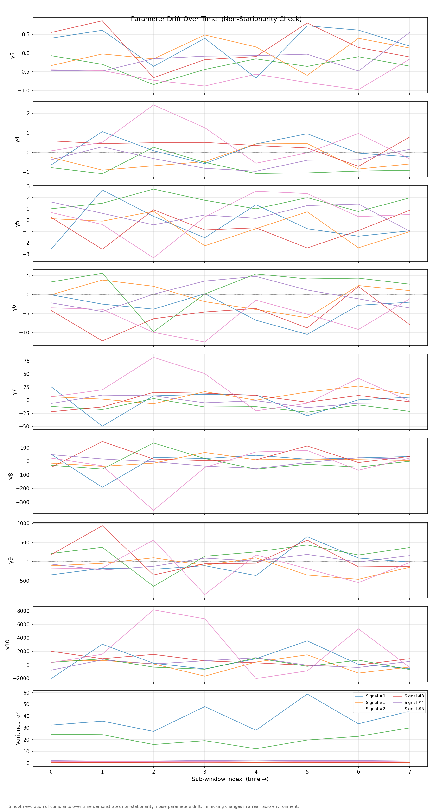

# Data Generation - Signal Denoising

Модуль генерує синтетичні датасети для задачі знешумлення радіосигналів.
Кожен приклад - пара «зашумлений сигнал / чистий сигнал»,
яку нейронна мережа вчиться відображати в процесі supervised learning.

---

## Де ми знаходимося в реальній системі

```
Антена -> LNA -> Mixer -> [IF фільтр] -> ADC -> DSP
  RF (МГц/ГГц)  |                               ^
            Downconversion                Тут ми знаходимось
```

Ми працюємо з **baseband-сигналом після downconversion**: цифровим потоком
після АЦП, де реальна несуча (МГц/ГГц) вже перенесена до нуля або низької IF.
Частоти 100-1000 Гц у датасеті відповідають спектральному вмісту сигналу
в baseband, а не реальній несучій.

**Чому real-valued, а не I/Q?**
SDR-приймач видає комплексний I/Q-сигнал (in-phase + quadrature).
Для цього дослідження обрано real-valued представлення з двох причин:
1. **Ізоляція змінної**: гіпотеза про вплив розподілу шуму перевіряється
   незалежно від форми представлення сигналу.
2. **Менше архітектурних змінних**: real-valued дозволяє зосередитися
   на ефекті розподілу шуму, а не на питаннях обробки комплексних даних.

---

## Структура датасету

### Тренувальний набір (`train/`)

Сигнали з **варіативним SNR**: кожен приклад має свій рівень шуму,
рівномірно розподілений у межах сценарію. Використовується для навчання і валідації.

### Тестовий набір (`test/`)

Сигнали з **фіксованим SNR**: кілька заздалегідь заданих рівнів шуму.
Дозволяє виміряти якість денойзингу при точно відомому SNR і побудувати криву «SNR -> метрика».

### Паралельні версії шуму

Кожен приклад зберігається у чотирьох версіях:

| Файл | Зміст |
|---|---|
| `clean_signals.npy` | Сигнал без шуму |
| `gaussian_signals.npy` | Сигнал + AWGN |
| `non_gaussian_signals.npy` | Сигнал + негауссовий шум |
| `non_gaussian_noise_only.npy` | Чистий негауссовий шум (без сигналу) |

Рядок `i` у всіх чотирьох масивах відповідає одному сигналу при одному SNR.
`non_gaussian_noise_only[i] = non_gaussian_signals[i] - clean_signals[i]`.

`evaluate_dataset.py` аналізує **чистий шум** (`non_gaussian_noise_only.npy`),
а не суміш сигнал+шум, що дає коректну оцінку розподілу шуму.

---

## Сценарії

| Параметр | `deep_space` | `fpv_telemetry` |
|---|---|---|
| Прототип | Voyager, CubeSat, Mars rovers | ELRS, Crossfire, Bluetooth |
| Модуляції | BPSK, QPSK | QPSK, CPFSK, GFSK |
| Несуча (baseband) | 100-800 Hz | 300-1000 Hz |
| SNR (train) | -20..0 дБ | -5..+15 дБ |
| SNR-точки (test) | -20, -15, -12, -10, -7, -5, 0 дБ | -5, 0, 3, 5, 8, 10, 15 дБ |

**Deep space** відповідає умовам надслабкого сигналу: при -20 дБ потужність шуму
в 100 разів перевищує потужність корисного сигналу. Саме в такому режимі
різниця між методами денойзингу має найбільше практичне значення.

---

## Модуляції

Генератор підтримує чотири типи модуляцій. Усі M-арні: параметр `bits_per_symbol`
визначає розмір алфавіту M = 2^bps.

**PSK (Phase Shift Keying):** `bps=1` -> BPSK (M=2), `bps=2` -> QPSK (M=4), `bps=3` -> 8-PSK і т. д.

**CPFSK (Continuous Phase FSK):** інформація кодується у частоті,
фаза неперервна між символами, що зменшує ширину смуги. `h=0.5` -> MSK.
Характерний для ELRS та подібних систем.

**GFSK:** CPFSK з гаусівською фільтрацією символьного потоку перед модуляцією.
Компактніший спектр порівняно з CPFSK. Стандарт Bluetooth і BLE.

**Symbol rate** прив'язаний до несучої: `symbol_rate = carrier / k`,
де `k` у діапазоні [6, 12] - кількість циклів несучої на символ,
реалістична умова для стабільної синхронізації у приймачі.

---

## Типи шуму

### Гауссовий (AWGN)

Адитивний білий гауссовий шум, baseline для порівняння.
У реальному ефірі AWGN апроксимує сукупну дію багатьох незалежних джерел:
теплового шуму компонентів приймача, широкосмугового космічного фонового
випромінювання та численних слабких некогерентних сигналів від далеких передавачів.
За центральною граничною теоремою їхня сума прямує до гауссового розподілу.

### Негауссовий

Реальне радіосередовище рідко обмежується чистим AWGN.
Типові джерела негауссових завад:

- **Атмосферні розряди** (блискавки, грозові фронти) - короткі широкосмугові імпульси
- **Co-channel та adjacent-channel interference** - сигнали інших передавачів на близьких частотах
- **Індустріальні EM-перешкоди** - силова електроніка, мотори, ВЧ-нагрів
- **Мерехтіння іоносфери** (scintillation) - нелінійна рефракція хвиль в іоносфері при геомагнітних бурях
- **Near-far ефект** - потужна близька станція на тлі слабкого цільового сигналу

Polygaussian noise моделює ситуацію, де в ефірі одночасно присутні кілька
таких джерел з різними потужностями - від фонового теплового шуму до
сильних імпульсних компонентів.

| Тип | Спектр | Фізичний прототип |
|---|---|---|
| `polygauss` | Рівний | Кілька одночасних джерел завад зі стабільними характеристиками |
| `polygauss_nonstationary` | Рівний, нестаціонарний | Мінливе радіосередовище: баланс між джерелами завад змінюється з часом |
| `impulse` | Широкосмуговий | EM-спалахи, перешкоди від силової електроніки |
| `pink` | 1/f | Флікер-шум підсилювачів |
| `red` | 1/f² | Броунівський шум, низькочастотні завади |

### Polygaussian noise - детальніше

**Стаціонарний (`polygauss`):** суміш K гауссіан з фіксованими (але випадково
обраними на початку генерації) вагами, середніми та дисперсіями.
Параметри не змінюються впродовж одного блоку сигналу.

**Нестаціонарний (`polygauss_nonstationary`):** суміш K гауссіан,
параметри якої **плавно дрейфують у часі** через процеси Орнштейна-Уленбека (OU):

- **Ваги** w_k(t): K траєкторій OU -> softmax, Σw_k = 1
- **Дисперсії** σ_k(t): K траєкторій OU у log-просторі -> exp > 0;
  log-зміщення рівномірно розподілені від -0.5 до +0.5 (σ ≈ 0.6...1.6),
  що дозволяє охоплювати як лептокуртичні (важкі хвости), так і платикуртичні (від'ємний ексцес) режими
- **Середні** μ_k(t): K-1 вільних траєкторій OU; остання визначається з умови
  нульового загального середнього: `μ_K(t) = -Σ_{k<K} w_k(t)*μ_k(t) / w_K(t)`

Час кореляції процесу OU: τ = 1/θ секунд. Це моделює реальне мінливе
радіосередовище: завади від сонячного вітру, руху супутника відносно джерела перешкод тощо.

**K** (`polygauss_components`, дефолт 3) - кількість компонент GMM.
Можна зафіксувати або задати діапазон для рандомізації per-sample.

---

## Параметри генератора

| Параметр | Дефолт | Опис |
|---|---|---|
| `num_samples` | (required) | Кількість прикладів у тренувальному наборі |
| `sample_rate` | 8192 | Частота дискретизації [Гц] |
| `block_size` | 256 | Кількість семплів на приклад; латентність = block_size / sample_rate |
| `scenario` | `deep_space` | Профіль сценарію |
| `modulation_type` | `bpsk` | Тип модуляції; `"random"` - вибір per-signal зі списку сценарію |
| `bits_per_symbol` | 1 | log₂(M): розмір алфавіту M = 2^bps |
| `snr_range` | з сценарію | (min_dB, max_dB), перекриває дефолт сценарію |
| `non_gaussian_noise_types` | `["polygauss_nonstationary"]` | Список типів негауссового шуму |
| `non_gaussian_mix_mode` | `"fixed"` | `"fixed"` = всі типи разом; `"random"` = випадкова підмножина per-sample |
| `polygauss_components` | 3 | Фіксована кількість компонент GMM |
| `polygauss_random_k` | `None` | `(k_min, k_max)` - рандомізувати K per-sample |

### Масштабування шуму до SNR

Всі типи шуму масштабуються через RMS:

```
σ_noise = sqrt( mean(signal^2) / 10^(SNR/10) )
```

Використання RMS замість std коректно враховує ненульове середнє
у pink/red і polygauss з ненульовими μ_k.

---

## Генерація

```bash
# Дефолт: deep_space, polygauss_nonstationary, bpsk, 50 000 прикладів
python data_generation/generation.py

# З явними параметрами
python data_generation/generation.py --deep_space --polygauss_nonstationary --modulation_type bpsk

# FPV-сценарій з GFSK, 4-FSK (bps=2)
python data_generation/generation.py --fpv --polygauss --modulation_type gfsk --bits_per_symbol 2

# Малий датасет для швидкої перевірки
python data_generation/generation.py --num_train 1000 --samples_per_snr 100

# Рандомна кількість компонент GMM
python data_generation/generation.py --polygauss_random_k 2 6

# Довідка
python data_generation/generation.py --help
```

Кожен запуск створює унікальну папку:

```
data_generation/datasets/
└── deep_space_polygauss_nonstationary_bpsk_bs256_n50000_6d07aecc/
    ├── dataset_config.json    <- всі параметри генерації + uid + timestamp
    ├── train/
    │   ├── clean_signals.npy                (50 000 x 256)  float32
    │   ├── gaussian_signals.npy             (50 000 x 256)  float32
    │   ├── non_gaussian_signals.npy         (50 000 x 256)  float32
    │   ├── non_gaussian_noise_only.npy      (50 000 x 256)  float32
    │   └── snr_values.npy                   (50 000,)        float32
    └── test/
        ├── test_m20dB_clean.npy                      (500 x 256)
        ├── test_m20dB_gaussian.npy                   (500 x 256)
        ├── test_m20dB_non_gaussian.npy               (500 x 256)
        ├── test_m20dB_non_gaussian_noise_only.npy    (500 x 256)
        └── ...  <- 7 SNR-точок x 4 типи = 28 файлів
```

> `data_generation/datasets/` додана до `.gitignore`.

`dataset_config.json` читається автоматично скриптом `evaluate_dataset.py`.

---

## Оцінка якості датасету

```bash
python data_generation/evaluate_dataset.py \
    data_generation/datasets/deep_space_polygauss_nonstationary_bpsk_bs256_n50000_6d07aecc/

# З вищим порядком кумулянтів
python data_generation/evaluate_dataset.py \
    data_generation/datasets/deep_space_polygauss_nonstationary_bpsk_bs256_n50000_6d07aecc/ \
    --max_order 6

# Довідка
python data_generation/evaluate_dataset.py --help
```

Скрипт читає `dataset_config.json`, автоматично встановлює `window_size = block_size`
і зберігає результати у `<run_folder>/dataset_evaluation/`.

### Логіка оцінки

Ключове питання: **чи охоплює датасет достатньо широкий спектр статистичних режимів шуму?**
Вузький розподіл у просторі кумулянтів означає, що нейронна мережа
тренується на статистично однорідних прикладах і може погано узагальнюватись.

**Розмір вікна і надійність оцінок:**

Кожен сигнал цілком є одним аналізованим вікном (`window_size = block_size`).

| Порядок | Мін. надійний розмір вікна |
|---|---|
| κ₃, κ₄ | ~50-100 семплів |
| κ₅, κ₆ | ~150-300 семплів |

При `block_size=256`: κ₃..κ₄ надійні, κ₅..κ₆ на межі.
Для вищих порядків збільшуйте `block_size` при генерації.

### Графіки

Всі графіки зберігаються у `<run_folder>/dataset_evaluation/`.
Нижче наведені приклади для датасету `deep_space / polygauss / bpsk`.

**S-K Coverage:** частка клітинок допустимої області (γ₄ >= γ₃² - 2)
у сітці 20x20, які містять хоча б один приклад. Поріг 70% - PASS.

---

**plot1 - S-K Scatter**



Горизонтальна вісь - скошеність γ₃ (асиметрія розподілу),
вертикальна - ексцес γ₄ (важкість хвостів відносно гауссіана).
Червона точка в (0, 0) - координати ідеального гауссового розподілу.
Пунктирна парабола γ₄ = γ₃² - 2 - нижня межа допустимої області:
жоден реальний розподіл не може знаходитися нижче неї.

Хороший датасет: хмара широко розкидана навколо початку координат.
Щільне скупчення біля (0, 0) означає, що шум занадто близький до гауссового.
Точки з великим γ₄ відповідають блокам шуму з важкими хвостами або імпульсними компонентами.

---

**plot2 - S-K Heatmap**



Та сама площина, але колір клітинки кодує кількість блоків шуму в ній (логарифмічна шкала).
Сіра заливка - фізично недопустима область нижче параболи.

Рівномірне забарвлення по всій допустимій зоні означає, що генератор
не концентрується в одному статистичному режимі. Яскраве пляма в одному місці -
сигнал про недостатнє різноманіття.

---

**plot3 - Cumulant Histograms**



По одній гістограмі на кожен обчислений порядок γ₃...γₙ.
Червона лінія - нуль (значення для гауссового розподілу, у якого всі кумулянти вище 2-го дорівнюють нулю).
Помаранчева лінія - медіана вибірки.

Широкий розподіл зі зміщеною медіаною підтверджує, що датасет містить
виражені негауссові режими. Вузький пік навколо нуля - шум практично гауссовий.

---

**plot4 - Cumulant Scatter Matrix**



Матриця попарних scatter-плотів для γ₃, γ₄, ..., γₙ.
На діагоналі - гістограма кожного кумулянту окремо.
Поза діагоналлю - scatter (γᵢ, γⱼ): аналог S-K plane для кожної пари.

Якщо точки заповнюють площину рівномірно - кумулянти несуть незалежну інформацію
про різні аспекти шуму. Якщо всі точки лежать на вузькій прямій -
γᵢ і γⱼ корельовані і несуть дублюючу інформацію.

---

**plot5 - Parameter Drift**



Кожна кольорова лінія - окремий блок шуму з датасету, розбитий на sub-windows по часу.
Панелі зверху вниз: γ₃(t), γ₄(t), ..., γₙ(t) і σ²(t).

Горизонтальні рівні лінії - стаціонарний процес, параметри шуму не змінюються.
Виражений дрейф - нестаціонарний шум: характеристики плавно еволюціонують
впродовж одного блоку. Для `polygauss_nonstationary` очікується
помітний дрейф; для `polygauss` лінії мають бути відносно рівними.

### Аргументи `evaluate_dataset.py`

| Аргумент | Дефолт | Опис |
|---|---|---|
| `dataset_dir` | (required) | Шлях до run-папки (з `dataset_config.json`) |
| `--window_size` | `block_size` з конфігу | Розмір вікна; менше -> більше вікон, менш надійна оцінка кумулянтів |
| `--max_order` | 4 | Максимальний порядок кумулянту (3-10) |
| `--coverage_threshold` | 70.0 | Поріг покриття S-K (%) |
| `--grid_bins` | 20 | Роздільна здатність S-K сітки |
| `--noise_type` | `non_gaussian` | Який файл аналізувати |
| `--n_signals` | всі | Обмежити аналіз першими N сигналами |
